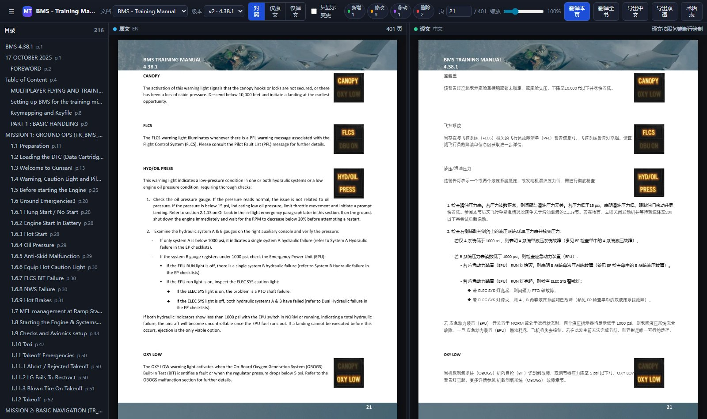
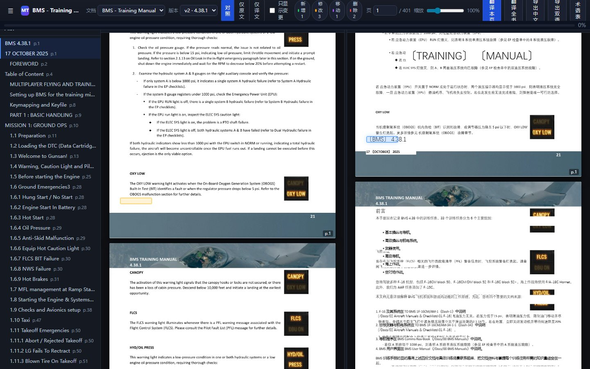
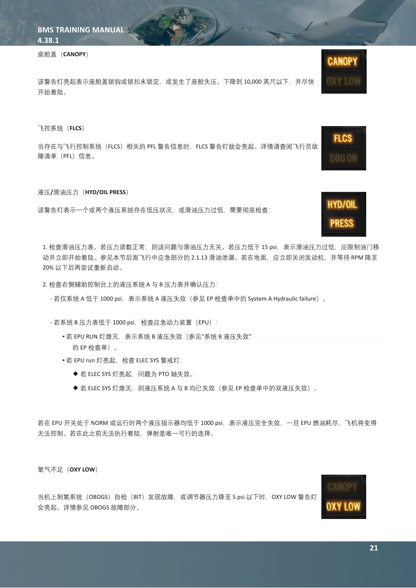
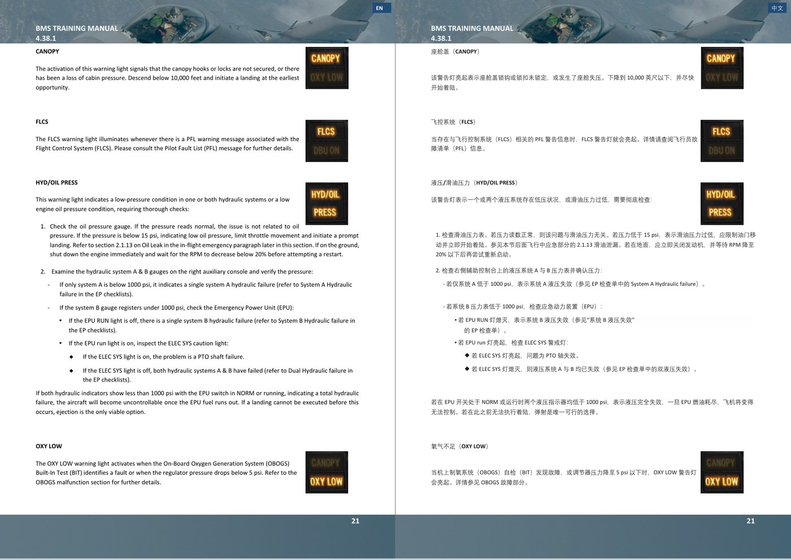
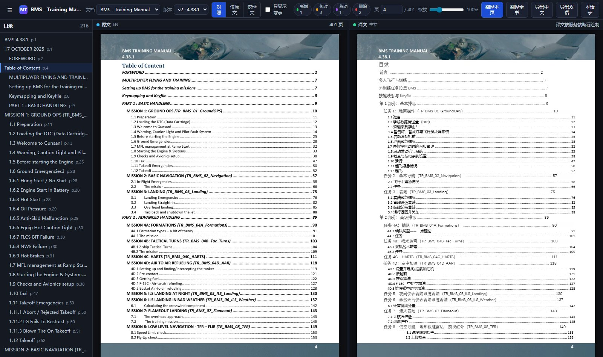
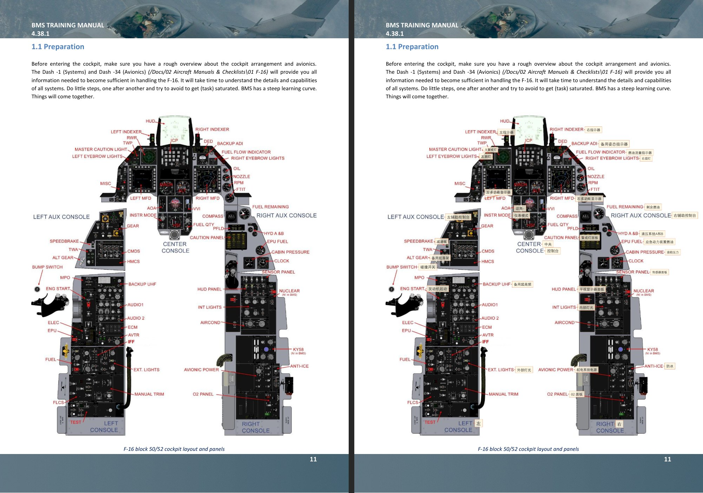
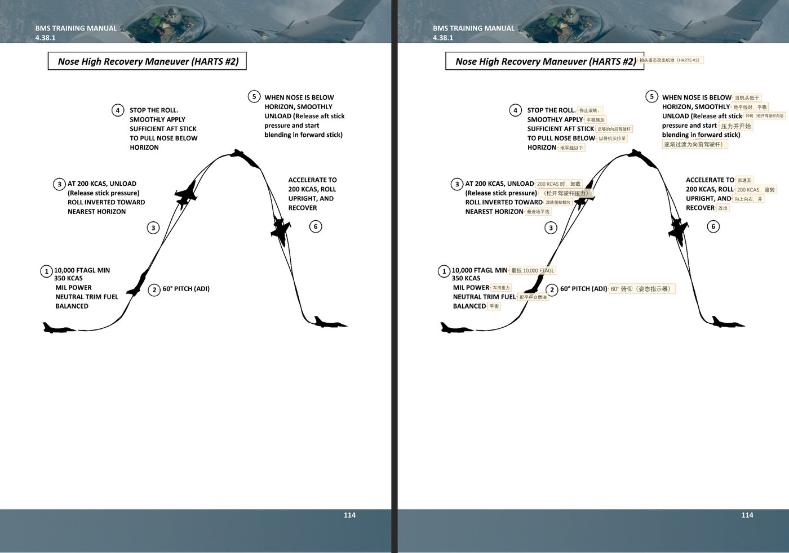
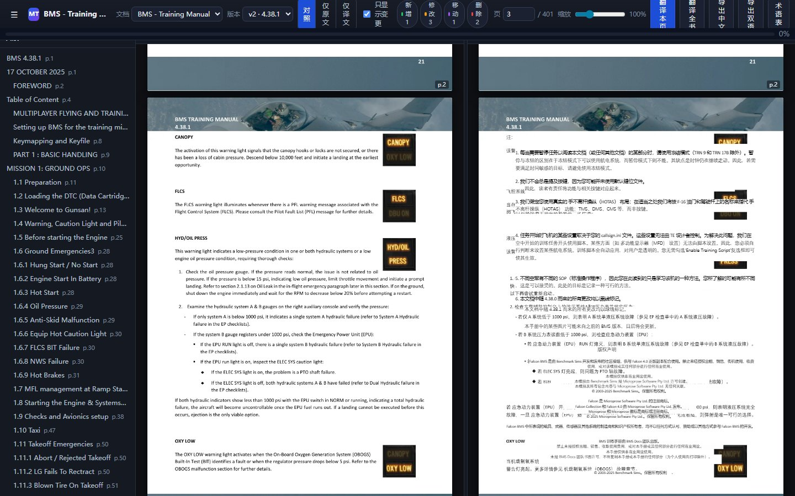

# falcon-bms-manual-translator

把英文飞行手册（Falcon BMS Training Manual / TO 系列）**元素级**重建为中文版，
并提供**中英双语对照浏览器**与**手册改版追踪**。

> 源 PDF 与译好的 PDF **不入库**（体积与版权原因）。本仓库只有脚本、文档和效果截图。

---

## 效果

### 中英对照浏览器：点一侧，另一侧自动高亮对应段落



左栏原文、右栏中文，段落一一对应。点击任一栏的段落，另一栏对应段落同步高亮；
双栏滚动联动；顶部可切换「对照 / 仅原文 / 仅译文」三种视图。



### 版式保留：不是截图，是可选中、可搜索的 PDF

逐页重放**图片 + 矢量图形 + 文本层**，原有英文正文被擦除后原位写入中文，
所以导出的中文 PDF 依然可以选词、搜索、复制。



双语版每页宽度 = 2 × 原页宽，左英右中并排：



### 目录页码列对齐

中文比英文短，直接沿用原文的点线会让页码参差不齐。这里按原书页码列的位置
重算点线长度，并把页码原样保留：



### 图内文字也翻译（双层标注）

手册里有大量**位图里的文字**（座舱图、仪表标注）无法靠文本层翻译。
做法是 OCR 抽出标签 → 翻译 → 以胶囊标注回贴，并自动跳过已经翻过的正文：





### 手册改版追踪：只重译改动的段落

原文更新时，段级 fingerprint 锚点 + 顺序比对识别
`修改 / 新增 / 删除 / 移动 / 重排 / 拆分 / 合并`，
未改动段落直接沿用旧译文（`carried`），小改动用旧译文当种子让模型修订（`seeded`）。



---

## 实测数据

三份真实手册（本机、无 GPU）：

| 手册 | 页数 | 段数 | 译文 | 缺失 | 入库耗时 | 翻译耗时 | 花费 |
|---|---|---|---|---|---|---|---|
| BMS Training Manual | 401 | 5,580 | 5,580 | 0 | 17–20 s | ~3 min | ≈ $0.10 |
| TO 1F-16CMAM-34-1-1 | 669 | 11,796 | 11,128 | 0 * | 28 s | 152 s | ≈ $0.19 |
| TO 1F-16CMAM-1 | 404 | 6,194 | 5,791 | 0 * | 33 s | 152 s | ≈ $0.19 |
| **合计** | **1,474** | **23,570** | **22,499** | **0** | — | — | **≈ $0.5** |

\* 未翻译的段恰好等于各手册的**页眉**数（页眉按设计不翻译）。

导出产物（未入库）：

| 产物 | 页数 | 大小 | 中文目录书签 |
|---|---|---|---|
| 训练手册中文版 | 401 | 37.2 MB | 216 条 |
| 训练手册双语版 | 401 | 38.5 MB | 216 条 |
| TO-1 中文版 | 404 | 30.6 MB | 560 条 |
| TO-34 中文版 | 669 | 53.9 MB | 1,093 条 |
| 图内文字标注样例 | 20 | 19.6 MB | — |

翻译质量抽样（真实产出）：

| 原文 | 译文 |
|---|---|
| `The activation of this warning light signals that the canopy hooks or locks are not secured, or there has been a loss of cabin pressure.` | `该警告灯亮起表示座舱盖挂钩或锁未锁定，或座舱失压。` |
| `MISSION 5: ILS LANDING AT NIGHT (TR_BMS_05_ILS_Landing)` | `任务 5：夜间仪表着陆系统着陆（TR_BMS_05_ILS_Landing）` ← 文件名逐字符保留 |
| `FAIR weather, few clouds at 5000 feet, winds 320°/5 knots, temperature 9°C` | `晴好天气，5000 ft 少云，风向 320°/5 kt，温度 9°C` |

---

## 设计要点

- **不栅格化**：重建的是图片 + 矢量 + 文本层，不是把页面拍成图。
- **表格不塌陷**：同一基线上的单元格按 x 间隙切成独立 `table_cell`；
  页眉跨行单元格按「同列 + 相邻基线 + 风格一致 + 网格不完整」合并。
- **段级指纹**：跨版本用 `canonical_text`（软连字符重接 + 全角/破折号/引号归一）
  算 fingerprint，改版后仍能认出「同一段」。
- **混合字体排版**：CJK 用 `Deng.ttf`，ASCII 走 `Calibri`（Deng 的拉丁字形是全角，
  直接混排会很难看）；布局分 `源 → 译 → 片段 → 行 → 盒子` 五层。
- **质量审计**：`cli.py quality` 用保守规则找残缺译文，
  再用「带上下文重译」定点修复，不必为几条问题重跑全书。

---

## 快速开始

```powershell
# 0) 依赖：Python 3.11
pip install -r requirements.txt
# 可选（图内文字翻译）：pip install rapidocr-onnxruntime onnxruntime
# 可选（浏览器端到端自测）：pip install playwright; playwright install chromium

# 1) 配置（config/local.json 已被 .gitignore 排除）
copy config\local.example.json config\local.json
#    填入 deepseek_api_key，或改用环境变量 DEEPSEEK_API_KEY

# 2) 放源 PDF
mkdir origin
copy <你的手册>.pdf origin\

# 3) 入库（抽取段落 + 建立版本）
python cli.py ingest --pdf "origin\BMS-Training-Manual.pdf" --slug bms-training-manual

# 4) 翻译（不花钱先估算）
python cli.py cost-estimate
python cli.py translate --provider deepseek --concurrency 8

# 5) 导出
python cli.py export --kind cn        --doc bms-training-manual
python cli.py export --kind bilingual --doc bms-training-manual

# 6) 打开对照浏览器
python cli.py serve        # -> http://127.0.0.1:8777
```

没有 API key 也能用：`--provider mock` 走离线占位译文，
或者只用已有译文跑导出与浏览器。

### 原文更新了怎么办

```powershell
python cli.py ingest --pdf "origin\BMS-Training-Manual_439.pdf"   # 登记为新版本，自动 diff
python cli.py diff --from 1 --to 2                                 # 看差异（不花钱）
python cli.py cost-estimate --version 2                            # 估算成本
python cli.py translate --version 2                                # 只重译改动过的段
```

---

## CLI

| 命令 | 作用 |
|---|---|
| `ingest` | 抽取 PDF 入库，建立版本 |
| `translate` | 增量翻译（未变段沿用、微改段用旧译文当种子） |
| `diff` | 版本差异（`修改/新增/删除/移动/重排/拆分/合并`） |
| `export` | 导出中文版 / 双语版 PDF（含中文目录书签） |
| `annotate` | 图内文字 OCR + 翻译 + 标注 |
| `quality` | 译文质量审计与定点修复 |
| `render-page` | 单页渲染（排查版式用） |
| `serve` | 对照浏览器 + REST API |
| `list` / `status` | 文档与翻译进度 |
| `simulate-update` | 构造一个「新版」PDF，用于回归演示 |
| `cost-estimate` | 只算 token 与费用，不调用 API |
| `portable` / `setup` | 打包到别的机器 / 目标机器自检 |

---

## 项目结构

```
core/       数据层：models / db / store / fingerprint / pdfdoc / paths
render/     渲染层：pagebuild（元素级重建）/ pdfout（导出）/ annotate（图内文字）
translate/  翻译层：engine（增量）/ prompt / glossary / quality（审计修复）
versions/   版本层：differ（段级差异）
web/        FastAPI 服务 + 前端（对照浏览器）
tests/      自测：core / translate / versions / render / web / e2e
spikes/     排查与验证脚本（每个 bug 的复现与验证都能单独跑）
docs/       开发过程记录与效果截图
CONTRACT.md 冻结的接口契约（模块边界、API 形状、实测结构数据）
```

---

## 测试

```powershell
python tests\test_core.py        # 33 项
python tests\test_translate.py   # 15 项
python tests\test_versions.py
python tests\test_render.py
python tests\test_web.py         # 179 项
python tests\test_e2e.py
```

---

## 已知限制

- 源 PDF 与译好的 PDF 不入库；需要自备手册。
- 图内文字翻译依赖 OCR，对手写体/低分辨率图效果有限；
  当前只自动挑选「图片占比高且文本少」的页面处理。
- 翻译质量依赖所用模型；`cli.py quality` 能发现残缺译文，但不能替代人工审校。
- 术语表需要人工维护。

---

## 说明

本项目是针对 Falcon BMS 社区文档的个人翻译工具。
手册原文版权归 Benchmark Sims 与相关文档团队所有，本仓库不包含任何手册内容。
